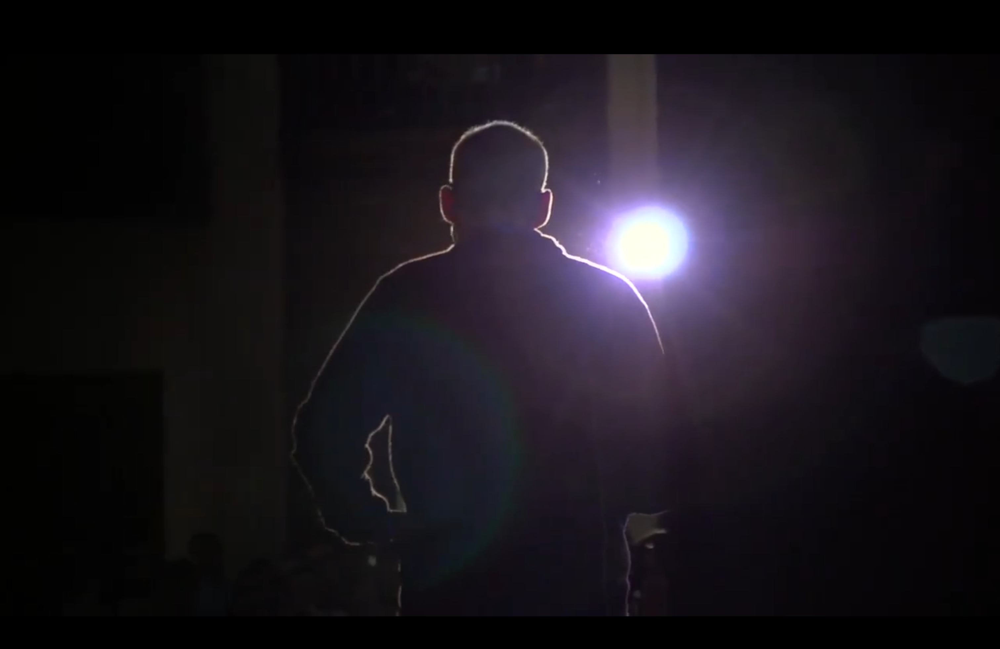

# Durchführung und Schritte
Teil der ersten Übung ist es mithilfe einer Tabelle erste, grobstrukturierte Annotationsdaten herzustellen. Dafür steht hier ein vorgesehenes Template bereit, in dem die zu analysierenden Parameter bereits festgelegt sind. Umfassende Informationen zu Parameterdefinitionen sowie Ansätze zur Segmentierung von Filmen und Bewegtbildern können in dem Kapitel [Weiterführende Informationen](../Kapitel_I/weiterführende_Informationen) eingesehen werden. 
## Segmentierung
In Bezug auf die Segmentierungslogik dient folgende Übersicht zur groben Orientierung:
```{figure} ../assets/Vier-Grundeinheiten-des-Films.png
:width: 600px
:name: grundeinheiten-film

Die vier Grundeinheiten des Films
```
## Durchführung
*Ein Schritt-für-Schritt-Guide*
* Als erstes werden Basisparameter für die zu analysierenden Segmente festgelegt; die Auswahl der zu untersuchenden Basisparameter soll dazu dienen, die zentralen kompositorischen Einheiten filmischer Intensitäten und Bewegungen als deskriptive Analysemuster in einem ersten Schritt greifen zu können.
    ````{margin}
    ```{admonition} Kategorisierung von "Bildinhalt"
    :class: hinweis
    Des weiteren haben wir den Parameter "Bildinhalt" hinzugefügt und diesen wie folgt kategorisiert: 
    1. Bühne
    2. Publikum
    3. 2D-Animation
    4. Found Footage
    5. Interview
    
    Es können auch ausführlichere Beschreibungen eingetragen werden. Wir haben uns für eine allgemeine Kategorisierung entschieden.
    ```
    ````
    Kurzdefinitionen zu den ausgewählten Basisparametern können hier eingesehen werden:
    ```{figure} ../assets/Kurzdefinition-Parameter.png
    :width: 600px
    :name: kurzdefinition-parameter

    Kurzdefinitionen zu den Basisparametern
    ```
    ```{admonition} Weiterführende Literatur zu Grundbegriffen
    :class: seealso
    Für eine vertiefende Beschäftigung mit den Grundbegriffen empfehlen wir folgende Internetseiten bzw. Lektüre:
    * <a href="https://filmanalyse.at/" class="external-link" target="_blank">Grundbegriffe Universität Wien</a>
    * <a href="https://www.netzwerk-cinema.ch/uploads/files/Glossaire_reaseau_cinema_ch.pdf" class="external-link" target="_blank">Netzwerk Cinema CH</a>
    * Hagener/Pantenburg: <a href="https://link.springer.com/book/10.1007/978-3-658-13339-9" class="external-link" target="_blank">Handbuch Filmanalyse</a>
    ```

    ````{margin}
    ```{admonition} Szenen und Einstellungen
    :class: caution
    Bei ganzen Filmen ist es zunächst sinnvoller nach Sequenzen und/oder Szenen zu segmentieren. Einzelne Szenen wiederrum können dann in Einstellungen eingeteilt werden.
    ```
    ````
* Anschließend wird eine Segmentierungslogik, nach der der Videoclip analysiert werden soll, festgelegt. Wir haben uns, aufgrund der Länge des Gegenstandes, für eine Segmentierung in **Einstellungen** entschieden (s. {numref}`grundeinheiten-film`). 
* Sobald die Grundstruktur der zu analysierenden Einheiten steht, kann mit der tabellarischen Annotation begonnen werden, d.h., dass den Parametern Inhalte bzw. Werte beigeordnet werden, die aus der Inszenierung des Videos hervorgehen. Ein Template (als [Word-Datei](../assets/Tabellarische-Annotation-Template-Quadriga.docx) und [PDF](../assets/Tabellarische-Annotation-Template-Quadriga.pdf)) zum Ausfüllen des Einstellungsprotokolls kann hier heruntergeladen werden.
## Tabellarischer Auszug (Exemplar)
| Nr. | Dauer (sec.) | Screenshot                | Bildinhalt   | Einstellungsgröße  | Montage                     | Kamera                         | Ton/Musik                          | Farbe            | Licht        |
|-----|-------------:|---------------------------|--------------|--------------------|-----------------------------|--------------------------------|------------------------------------|------------------|--------------|
| 01  | 05''         |  | Bühne        | medium shot        | harter Schnitt              | low-angle; Fahrt: leicht>links | Dialog/Rede (onscreen)             | schwarz          | dunkel       |
| 02  | 07''         |  | 2D-Animation | closeup            | harter Schnitt              | high-angle; Fahrt: unten>oben  | Dialog/Rede /Gelächter (offscreen) | weiß, braun, rot | dunkel; hell |
| 03  | 04''         |  | Bühne        | medium closeup     | harter Schnitt              | straight-angle; unbewegt       | Dialog/Rede (onscreen)             | schwarz; grau    | dunkel       |
| 04  | 03''         |  | Publikum     | shoulder closeup   | harter Schnitt; Gegenschuss | straight-angle; unbewegt       | Applaus (onscreen)                 | orange; schwarz  | dunkel       |
| 05  | 03''         |  | Bühne        | medium closeup     | harter Schnitt; Gegenschuss | straight-angle; unbewegt       | Dialog/Rede (onscreen)             | schwarz; grau    | dunkel       |
```{admonition} Wichtig
:class: caution
Eine tabellarische Annotation erfordert viel Zeit und Aufmerksamkeit, da alle Daten, beispielsweise mit einem Textprogramm, manuell eingetragen werden müssen. 
```
## Schritte
Folgende Schritte sollen als Anweisung dienen, um die Durchführung der tabellarischen Annotation eigenständig reproduzieren zu können:
+++
1. *Segmentierung*: Das Video soll in diesem Schritt in die jeweiligen Einstellungen segmentiert werden
2. *Annotationsarbeit*: Die tabellarische Annotation kann beginnen, das Template kann vollständig ausgefüllt werden 
3. *Vergleichen*: Die Ergebnisse können mit der bereitgestellten Musterlösung verglichen werden
```{admonition} Achtung
:class: caution
Die Annotationen bzw. Annotationsmethode kann sich in einigen Punkten auch unterscheiden. Entscheidend ist, dass filmanalytische Daten in einem ersten Schritt erfasst und verglichen werden können.
```
Die Tabelle liegt ausgefüllt vor? 👏 Dann geht es zum nächsten Schritt ➡️ 
+++
Für einen Vergleich der Daten kann unsere [Musterlösung](../assets/Tabellarische-Annotation-Musterlösung-Quadriga.pdf) heruntergeladen werden.
