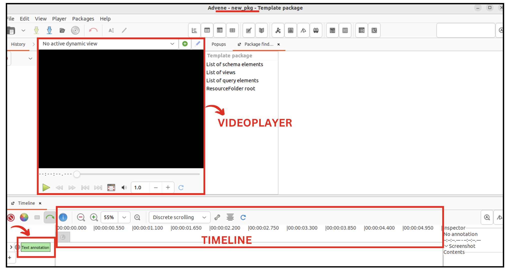

# Annotieren mit *Advene* 

Für detailreiche Erklärungen zu der Bedienung von Advene stehen [hier](https://github.com/oaubert/advene/wiki/AdveneUserGuide)  sowie [hier](https://www.advene.org/screencasts.html#screencasts) Userguides zur Verfügung, in denen die wesentlichen Funktionen und Optionen von Advene erklärt werden. <br>
Die für *unseren* Workflow wichtigen Funktionen sollen im Folgenden in einem Schritt-für-Schritt Guide reproduziert und nachvollzogen werden.

## Einrichtung, Bedienung und Interface

Wird die Anwendung gestartet, öffnet sich automatisch ein leeres Template bzw. ein Paket, das als advenespezifische **'.azp'** Datei gespeichert werden kann. Das Paket (Package) enthält zunächst ein einfaches **'simple text'** Schema (mit dem Wert: `text/plain`), mit dem wir in dieser Übung arbeiten werden. 
```{admonition} Formen für Annotationstypen
Andere Schemata bzw. Annotationstypen, wie z.B. **'JSON data'** oder **'Keyword list'**, stehen ebenfalls zur Verfügung. Unter "Annotation Types" im [Userguide](https://github.com/oaubert/advene/wiki/AdveneUserGuide) finden sich ausführliche Informationen zu den einzelnen Typen.
```
Im Zentrum der Anwendung ist ein Videoplayer sowie eine Timeline zu sehen. Am linken Rand erscheinen die Annotationstypen (in unserem Fall werden es die einzelnen zu analysierenden Parameter sein). 
+++

+++
In einem separaten Schritt wird nun unsere Videodatei mit dem Package verknüpft. Dafür unter dem Reiter 'File' die Option 'Associate a video file' auswählen. 
+++
Mit der Verknüpfung von Video und Package sieht man nun in der Timeline den Verlauf der Videodatei mit Einzelbildern. Die Timeline ist nur eine von mehreren sogenannten Views, also Ansichten, mit der gearbeitet werden kann. Weitere Ansichtsübersichten können ebenfalls hinzugefügt und nach eigenen Wünschen angeordnet werden. Jede View entspricht einer anderen Darstellungs- oder Visualisierungsform für Annotationen.
+++
Mit 'zoom in' bzw. 'zoom out' kann die Ansichtsgröße der Timeline angepasst und nach eigenen Belieben skaliert werden. 