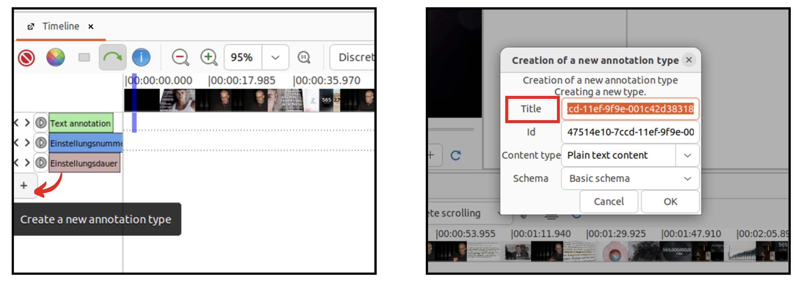

# *Advene*: Annotationstypen und Annotationen
## Hinzufügen und bearbeiten der ausgewählten Parameter

````{margin}
```{admonition} Was ist ein MIME Type?
Ein **MIME Type** (Multipurpose Internet Mail Extensions) ist ein Standardformat im Internet, um den Dateityp und den Inhalt einer Datei anzugeben. Er besteht aus einem Haupttyp (z.B. "text" oder "image") und einem Subtyp (z.B. "html", "jpeg"), die durch einen Schrägstrich voneinander getrennt sind: z.B. "text/html" für eine HTML-Datei oder "image/jpeg" für ein JPEG-Bild.
```
````
Mit einem Klick auf das Plus-Symbol am linken Rand der Timeline können nun unsere Parameter bzw. Annotationstypen erstellt werden. Jeder Annotationstyp hat einen 'Title', eine 'Id', einen 'Content type' sowie ein zugeordnetes 'Schema'. Da wir hier mit dem voreingestellten **MIME Type** `plain text content` arbeiten, muss nur das Feld 'Title' bearbeitet werden. 
+++

+++
Nun erscheint der neu erstellte Annotationstyp. Um diesen zu bearbeiten, beispielsweise zur Anpassung der Farbe, können mit einem Rechtsklick auf den Typen Änderungen vorgenommen werden. Änderungen im Edit-Fenster müssen immer bestätigt werden.
```{hint}
Bestimmungen im Register Advanced können für diese Annotationsübung erstmal ignoriert werden. 
```

+++
Die Annotationstypen können mit einem Klick auf den bunten Kreis nach Belieben ein- und ausgeblendet werden. 
```{image} ../_images/A2-S05.png
:align: center
:height: 450px
:name: a2-s05
```
## Annotationen erstellen 

Nun geht es darum, die Annotationen für die erstellten Parameter/Typen zu erstellen. 
+++
Doch nach welcher Segmentierungslogik sollen die Annotationen erstellt werden?
